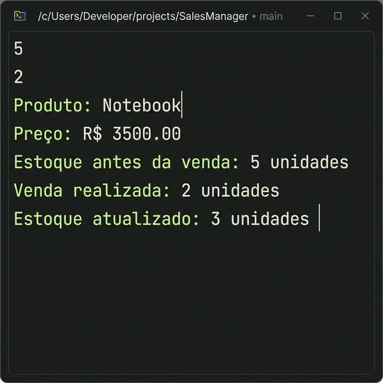

<<<<<<< HEAD
# Controle de Estoque

Projeto desenvolvido em Java para controle de estoque de produtos de uma loja.

## Descrição

O programa permite o cadastro de um produto e a atualização da quantidade em estoque após uma venda.

## Funcionalidades

- Leitura dos dados do produto (nome, preço, quantidade em estoque)
- Processamento de venda com redução do estoque
- Validação de estoque insuficiente
- Exibição das informações antes e depois da venda

## Entrada

| Campo | Tipo |
|---|---|
| Nome do produto | String |
| Preço | double |
| Quantidade inicial em estoque | int |
| Quantidade vendida | int |

## Execução

### Exemplo 1 — Venda realizada com sucesso

**Entrada:**
```
Notebook
3500.00
5
2
```

**Saída:**
```
Produto: Notebook
Preço: R$ 3500.00
Estoque antes da venda: 5 unidades
Venda realizada: 2 unidades
Estoque atualizado: 3 unidades
```

### Exemplo 2 — Estoque insuficiente

**Entrada:**
```
Notebook
3500.00
5
10
```

**Saída:**
```
Produto: Notebook
Preço: R$ 3500.00
Estoque antes da venda: 5 unidades
Estoque insuficiente para realizar a venda.
```

## Print da Execução



## Como executar

```bash
javac ControleEstoque.java
java ControleEstoque
```

## Tecnologias

- Java
- Scanner (entrada de dados)
=======
# controledeestoque
>>>>>>> d037d93e64994182f44f53e458d1aa483b15b324
